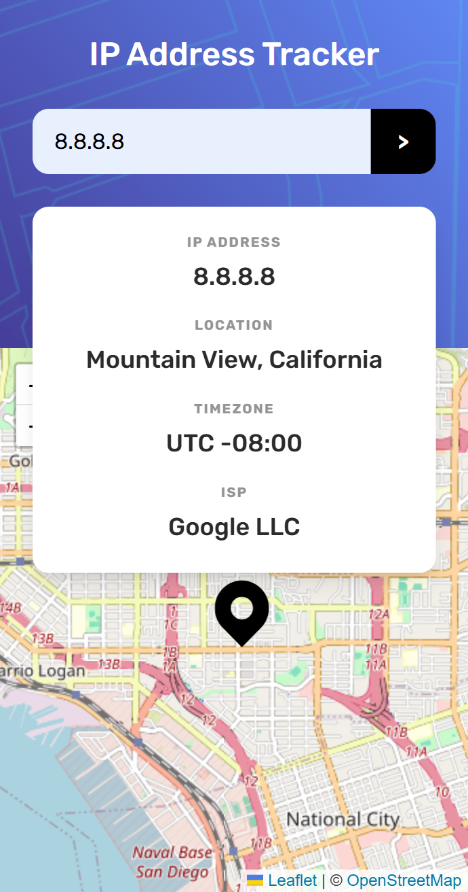
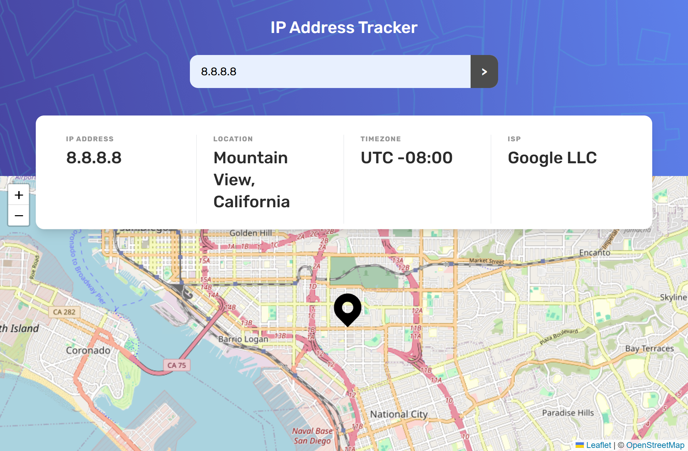

# Frontend Mentor - IP address tracker solution

This is a solution to the [IP address tracker challenge on Frontend Mentor](https://www.frontendmentor.io/challenges/ip-address-tracker-I8-0yYAH0). Frontend Mentor challenges help you improve your coding skills by building realistic projects.

## Table of contents

- [Overview](#overview)
  - [The challenge](#the-challenge)
  - [Screenshot](#screenshot)
  - [Links](#links)
- [My process](#my-process)
  - [Built with](#built-with)
  - [What I learned](#what-i-learned)
  - [Useful resources](#useful-resources)
- [Author](#author)

## Overview

### The challenge

Users should be able to:

- View the optimal layout for each page depending on their device's screen size
- See hover states for all interactive elements on the page
- See their own IP address on the map on the initial page load
- Search for any IP addresses or domains and see the key information and location

### Screenshot

### Links

- Solution URL: [GitHub Repo](https://github.com/lianxxxx/ip-address-tracker)
- Live Site URL: [Vercel](https://ip-address-tracker-react-app-lianxxxx.vercel.app/)

## My process

### Built with

- Semantic HTML5 markup
- CSS custom properties
- Flexbox
- CSS Grid
- Mobile-first workflow
- [React](https://reactjs.org/) - JS library
- [Vite](https://vite.dev/) - Frontend build tool
- [Tailwind](https://tailwindcss.com/) - CSS framework

### What I learned

Even if you put an API key in a .env file and add it to .gitignore, it can still be seen if you use it directly in frontend code. When the app is built, the API key becomes part of the JavaScript file sent to the browser, so anyone can see it using DevTools.

To fix this, I used Vercel serverless functions. The API key stays on the server in Vercel’s environment variables, and the frontend just calls the serverless function. This way, the API key is never exposed to users.

## Useful resources

- [Vercel](https://vercel.com/docs/functions) - This helped me understand how to securely hide API keys by creating serverless functions.
- [IPify Geolocation API](https://geo.ipify.org/) - Used this API to fetch IP address geolocation data including location, timezone, and ISP information.
- [React Leaflet](https://react-leaflet.js.org/) - This library helped me integrate interactive maps into my React application.
- [Google Fonts](https://fonts.google.com/) - Used this to find and implement custom typography that matches the design requirements.
- [Claude AI](https://claude.ai) - Helped me finally understand how to properly implement environment variables in production and detect user IP addresses.

## Author

- Frontend Mentor - [@lianxxxx](https://www.frontendmentor.io/profile/lianxxxx)
- GitHub - [@lianxxxx](https://github.com/lianxxxx)
